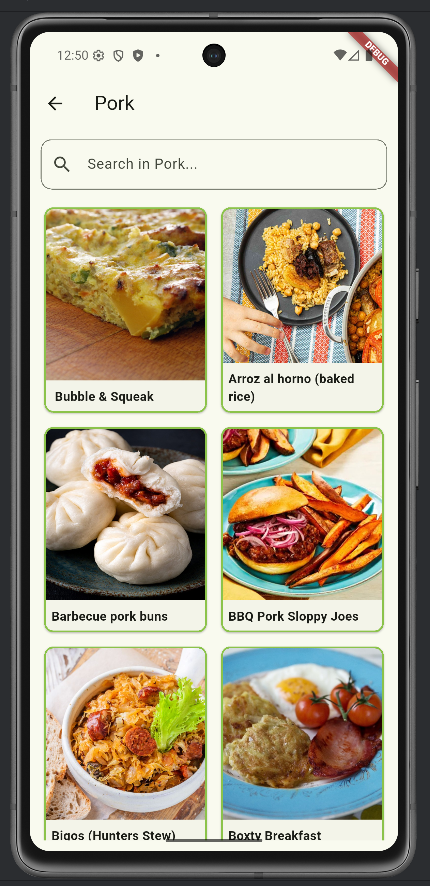
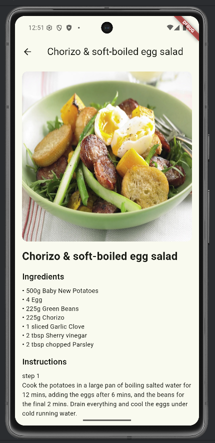
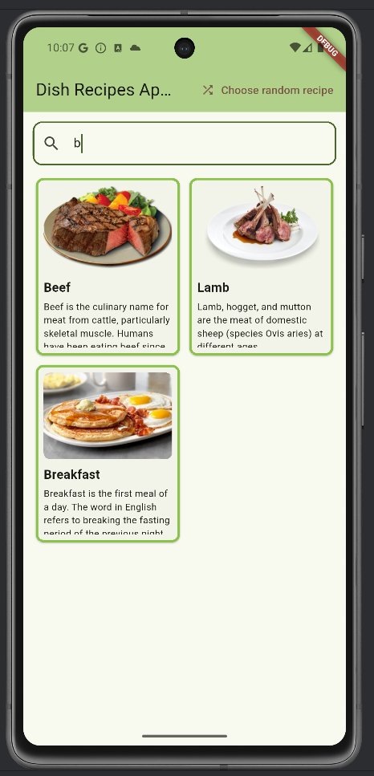
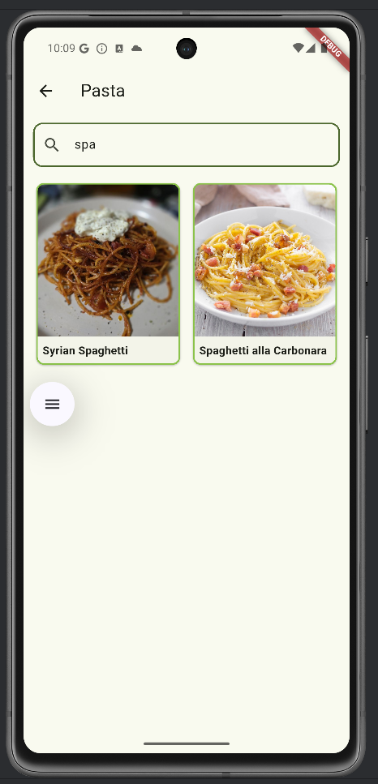
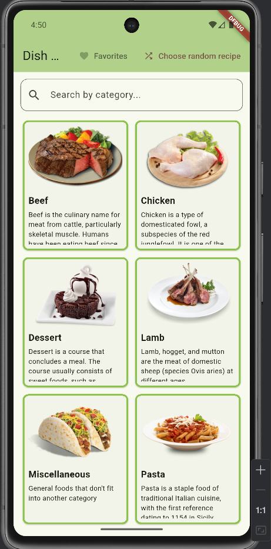
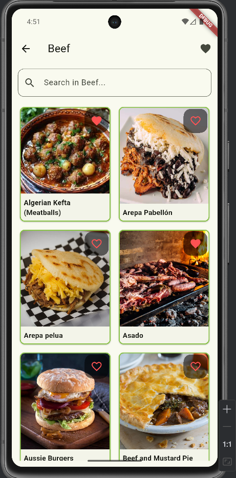
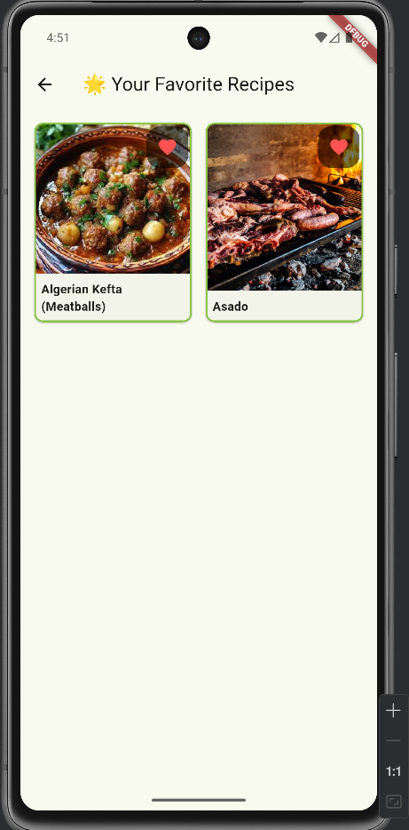
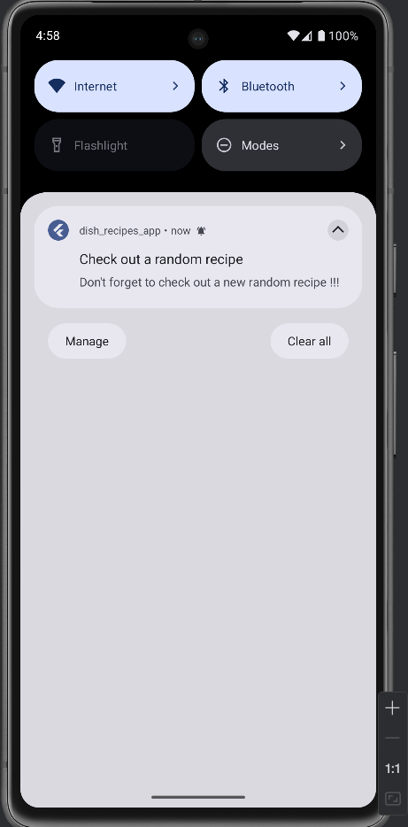

# dish_recipes_app

A dish recipes app.

## Screen shots of the app

### Lab 2 Screen shots of the app

### Lab 3 added functionalities screen shots

## Screencasts 

### Lab 2 screencast

https://youtube.com/shorts/0c8zCeDZpC4

https://youtube.com/shorts/Ef24kUcKB6E

https://youtube.com/shorts/8CaeMWEf6zY

### Lab 3 screencast

**Notifications:**

[notification-test.webm](docs/notification-test.webm)

**Like a meal:**

[favorite_meals.webm](docs/favorite_meals.webm)